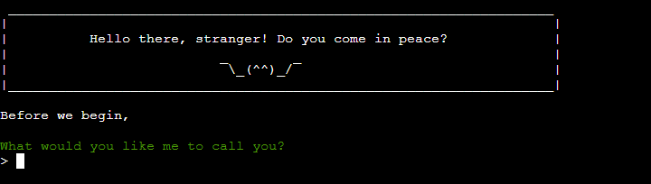

# Procrasti-Not
## Introduction
Procrasti-Not is your friendly neighbourhood bot for your procrastination misfortunes.<br>As many of us struggle with keeping on track with the tasks we've set out for ourselves on a specific day, I decided to create a "friend" that helps decide the order the tasks will be completed and also offers incentive to do so.<br>

The app is developed in Python and presented in a web browser using the Code Institute Python Template which creates a mock terminal.<br><br>


[View the project here](https://procrasti-not.herokuapp.com/) - *Please note: To open any links in this document in a new browser tab, please press CTRL + Click.*

## Table of Contents
* [User Experience Design (UX)](#UX)
    * [Strategy](#strategy)
      * [User Stories](#User-Stories)
    * [Scope](#scope)
    * [Structure](#structure)
      * [App Logic](#application-logic)
    * [Skeleton and Surface](#skeleton-and-surface)
      * [Text Layouts](#text-layouts)        
      * [Chromatics](#chromatics)
* [Features](#features)
* [Future Enhancements](#future-enhancements)
* [Testing](#testing)
* [Deployment](#deployment)
* [Credits](#credits)

## UX
### Strategy
Procrasti-Not is intended to be a helpful tool for individuals struggling to keep on track with tasks set out for the day. <br>Many times, I find that the issue with procrastination stems from the inability to decide what to do, when. Procrasti-Not will help the user with this issue in a fun and engaging way, to hopefully allow the user to feel more time efficient throughout their day. 

#### User Stories
* As a user I want an app that makes managing my tasks efficiently easier
* As a user I want help with choosing which task to perform
* As a user I want the app to feel friendly, helpful and personalized
* As a user I want clear instructions about the app functions
* As a user I want to be able to see how many tasks remain
* As a user I want task completion to feel rewarding
* As a user I want to be able to view, edit, add and delete tasks

### Scope
In order for the tool to provide the user with the functionality and experience set out in the User Stories, I intend to write the information printed to the user in a "conversational" way, where the user is being guided, coached and cheered on by a friendly bot named Procrasti-Not. <br><br>    In addition to this, I plan to include the following features:
* A detailed "How it works" text that the user can choose to read
* An initial setup function that allows the user to enter multiple tasks at once
* A function that randomly choses a task for the user
* A function that, upon user confirmation, marks the current task as completed
* A completion tracker that informs the user how many tasks remain
* Functions that allows the user to view, edit, add and delete tasks

### Structure

#### Application Logic
Once the features of the app were identified, the next step was to plan the application logic.

This involved breaking down the app into 3 main tasks, as well as identifying the steps that the user would take to complete and navigate between each task, including mapping out any and all sub tasks that would be required. This step was crucial in understanding the flow of the app, and how each section would connect to the other. 

The flow of the app was originally sketched out using pen and paper, but I later used [draw.io](https://app.diagrams.net/) for a more visually presentable flow chart which you can see below.


In addition to the above, I found that the app worked smoother if an "escape option" was added in to every user input. The user can at any point of the app input a zero (0) to be brought back to the SETUP MENU.

### Skeleton and Surface
#### Text Layouts
Due to the nature of the project, in which the webpage layout and design is not a factor, I still wanted the application to look inviting. I therefore sketched the look of the main menus beforehand, simply by using [Notepad++](https://notepad-plus-plus.org/downloads/), in order for the information that the user gains at any one particular view to be easily interpreted.

I chose to make clear divides between menu headers, general information and user interaction options.

Below you'll find screenshots of the mockup layouts.


#### Chromatics
During the development of the project, I realised that long white text blocks on black background makes it difficult to distinguish whether information is important or not. As such, I wanted to find a way to make promts and interactions stand out to increase usability. At project inception I was unaware of the fact that even terminal text can be colored, but I somehow stumbled upon a [forum post](https://stackoverflow.com/questions/287871/how-do-i-print-colored-text-to-the-terminal) where this was discussed. 


The color scheme I chose for different levels of importance was loosely based on color psychology. Green was chosen for text that needs to "semi-stand out" to the user, as it is a calming and reassuring color that does not feel overly aggressive or attention-grabbing. Cyan, on the other hand, was chosen for text that needs to be of even higher importance, as it is a color that conveys professionalism, and a sense of importance. Finally, red was chosen for very important information, as it is a color that naturally draws attention and is commonly associated with warnings and danger.

## Features
All app features are created with the user story
`"As a user I want an app that makes managing my tasks efficiently easier"` in mind, as it is the basis of the entire project. However, I will specify the other features and the implementation of the requested functions below.
<br>

```
USER STORY:

As a user I want the app to feel friendly, helpful and personalized

IMPLEMENTATION:
```
### First hello

* When the app is launched, the user is greeted by a friendly message with an ASCII emoji, inviting them to enter their name to proceed
* This feature adds a fun and engaging touch to the app, making it more welcoming for users and providing a positive first impression

### Welcome Screen

* Once their name is entered, the app will generate a personalized message and display the main menu of the Task Manager app
* The user is now given the option to read the app handbook or jump straight into setting up their To-Do list

---


```
USER STORY:

As a user I want clear instructions about the app functions

IMPLEMENTATION:
```

### User Handbook
The app contains a handbook, or a "beginners guide" that is easily accessible from the first welcome screen.

* Explains the purpose of the app
* Explains the app functions

---


```
USER STORY:

As a user I want to be able to view, edit, add and delete tasks

IMPLEMENTATION:
```
### Main Menu
The main menu is the central hub of the Task Manager app, providing users with access to all of the app's key features.


* Users can add tasks to their list
* Users can choose to enter the menu for editing/deleting existing tasks (1)
* Users can jump into the task manager (2)


* When a user adds a task to their To Do-list, the screen is reloaded to clearly show what task was added and what the user options are currently

### Edit Menu
From the main menu option 1, the user is taken to the edit menu which provides users with a way to update or remove existing tasks from their To Do-list

* The user is prompted to choose the index of the task they wish to target


* The user is then prompted to select whether they wish to (e)dit or (d)elete the selected task
* If the user chooses to edit the task, they will be prompted to write the task anew, in actuality replacing one task with another


* Once the selected task has been edited or deleted, the user is prompted with a confirmation and a print out of the new and updated list
* The user will then be asked whether they wish to continue to edit tasks or not, where choosing (n) will take the user back to the main menu again

---


```
USER STORY:

* As a user I want help with choosing which task to perform
* As a user I want to see how many tasks remain

IMPLEMENTATION:
```
### Task Manager
The task manager is where the real work gets done. Once the user has added tasks to their task list, they can jump into the task manager by selecting option 2 from the main menu.

* The task manager will automatically choose a task from the users To Do-list at random
* The user is informed of how many tasks remain in the list once they have completed the chosen task
* The user is prompted to answer whether the task has been completed or not


* If the user has completed the task, they are given a random encouragement while waiting for the next task to be selected


* Should the user not complete the task, they are given options to temporarily skip the task, permanently skip the task (deleting it) or to quit the app all together
* If the user chooses to quit the app, they are specifically asked to confirm this as shown below


---


```
USER STORY:

As a user I want task completion to feel rewarding

IMPLEMENTATION:
```

### Completion Screen
Upon completing all tasks, the user will automatically be taken to a final screen as shown below.

* The user is congratulated on a job well done
* The completed tasks are listed
* The user is prompted to choose to either start over with a new To Do list or to quit the app together
* The quit app choice is _not_ followed by a confirmation in this case, as I didn't feel it that it was necessary at the end of the app

---


### Escape (0)

* Due to the app having multiple sub menus and locations, I felt that it was necessary to add a sort of "fail safe escape" from all places where the user is prompted to input information. Therefore, submitting 0 will always take the user back to the Main Menu

## Future Enhancements
* Ability to store user information (incl. task lists)
  * As it stands, any name or list data that the user submits is forgotten as soon as the app/page is reloaded. I feel that the app could be more useful going forward if the app could get previously saved information for the user to easily "take up where they left off"

## Testing
The project has been tested at every step of the project development, but I also asked friends and family to do detailed testing when the build was near completion. The few issues and inconveniences that were found during this testing phase have all been solved.

Upon project completion I have personally done extensive testing on every feature, as documented below. You can find the test document in it's entirety [here](https://docs.google.com/spreadsheets/d/1F_x43U3o0Q7jiaN1o71_HNXEbTof01x1Y1HkhxJOdME/edit?usp=sharing).


### Validator Testing
* Python Checker - The python code was evaluated using the [CI Python Linter](https://pep8ci.herokuapp.com/) without any issues


<details>
  <summary>Results for run.py</summary>

  
</details>
<details>
  <summary>Results for tasks.py</summary>
  
  
</details>
  <details>
  <summary>Results for utilities.py</summary>
  
  
</details>
<br>

### Notable Bugs
There has not been any notable bugs that impact functionality during the development of the project. 
<br>

## Deployment

The project was deployed using Heroku. The steps to deploy are as follows:

#### **Heroku Deployment** - Project Creation and Settings<br>
1. Sign up or Log in to [Heroku](https://heroku.com/)
2. Once in your dashboard, select "New" and then "Create New App"
3. Give your project a name (must be unique), select your region and confirm "create app"<br>

You'll now be taken to the Heroku Deployment Tab. In order to use the Code Institute mock terminal template for your deployed project, you'll need to do the following:

4. Navigate to the "Settings" tab
5. Click "Reveal Config Vars" to add a configuration variable with Key: **PORT** and Value: **8000**
6. Click "Add Buildpack" and add the packs **Python** and **NodeJS**
    * *Note that the order of added buildpacks have meaning. In this case, Python should be the first (top) and NodeJS second (bottom)*

#### **Heroku Deployment** - Deploying a Github Repository<br>
1. Navigate to the "Deployment" tab
2. Select "GitHub - Connect" under Deployment method and follow the steps necessary to connect your GitHub account
3. Select your GitHub account from the droplist, enter your repository name and click search
4. Choose "Connect" at the correct repository to connect the repo to your Heroku app
5. Further down on the Deployment page, you'll find "Automatic deploys" and "Manual deploy"
    * For automatic, choose the branch you wish to deploy and click "Enable Automatic Deploys".<br> This allows Heroku to automatically rebuild your app when your Github repository is updated
    * For manual, choose the branch you wish to deploy and click "Deploy Branch"
6. Once Heroku is finished with the build process you will be notified with a "Your App Was Successfully Deployed" message and a link to the app

#### **Forking** the GitHub Repository<br>

If you wish to make a copy of the repository to your own GitHub account, you can do so by "Forking" it.<br>
This will give you a full working copy of the project, but ensures that no changes you make affect the original repository.
1. Navigate to the GitHub repository while logged into your account
2. In your top right, click the Fork button
3. Chose the name you want to give your version of the repository *(automatically filled in as the original project name)*
4. Click the green "Create fork" button

#### **Cloning** the GitHub Repository<br>

If you wish to download a local version of the repository to be worked on, you can do that too. That is referred to as "Cloning".<br>
The steps to cloning the repository are as follows:
1. Navigate to the GitHub repository while logged into your account
2. Click the <>Code dropdown button
3. Make sure that HTTPS is chosen, then copy the repository link to the clipboard<br>
*Git must be installed for the next steps to work*<br>
4. Open the IDE you're working in
5. Type "git clone (the url link you just copied)" into the terminal

The project will now be on your local machine to use or save. This can be a good way to back up versions of your own work too.

## Credits

### Utilised Libraries

- **`os`**  <br>was imported to help clear the terminal, thus keeping the interface polished and distraction-free for the user
- **`sys`**  <br>is used to close the app in an easy and seamless way
- **`random`**  <br>helps the user pick a random task from their list. The function is also used to pick randome encouraging sentences to cheer the user on
- **`time`**  <br>is merely used to give the user pause between screens, in the situations where I did not wish for user interaction
- **`colorama`**  <br>was a game-changer, allowing me to make sure users read and interpret the text properly, easily and with enjoyment

### Code
* [Stack Overflow](https://stackoverflow.com/) has been browsed frequently in order to grow my understanding of Python in general
* [Code Institute](https://codeinstitute.net/se/) and the course material has been crucial to develop this project<br><br>
* Code to clear the terminal was found on [Stack Overflow](https://stackoverflow.com/questions/2084508/clear-terminal-in-python)

### Acknowledgements
* Huge thanks to Daisy McGirr for being an epic mentor, as usual!